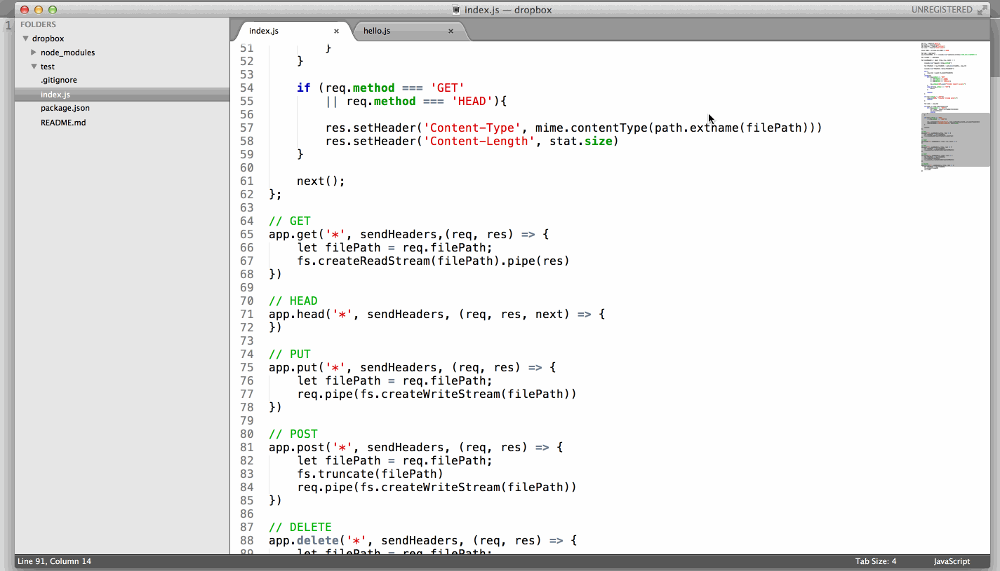
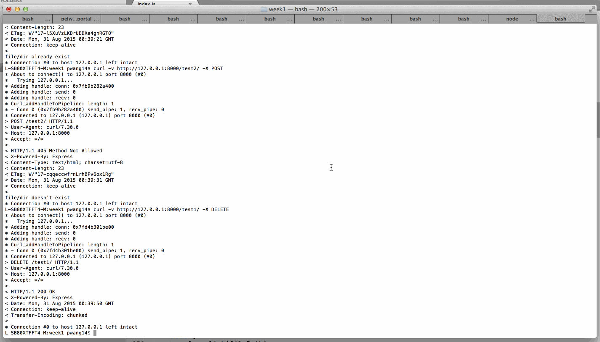

## Dropbox

This is a basic Dropbox clone to sync files across multiple remote folders.

Time spent: `<Number of hours spent>`

### Features

#### Required

- [X] Client can make GET requests to get file or directory contents
- [X] Client can make HEAD request to get just the GET headers 
- [X] Client can make PUT requests to create new directories and files with content
- [X] Client can make POST requests to update the contents of a file
- [X] Client can make DELETE requests to delete files and folders
- [X] Server will serve from `--dir` or cwd as root
- [ ] Client will sync from server over TCP to cwd or CLI `dir` argument

### Optional

- [ ] Client and User will be redirected from HTTP to HTTPS
- [ ] Server will sync from client over TCP
- [ ] Client will preserve a 'Conflict' file when pushed changes preceeding local edits
- [ ] Client can stream and scrub video files (e.g., on iOS)
- [ ] Client can download a directory as an archive
- [ ] Client can create a directory with an archive
- [ ] User can connect to the server using an FTP client

### Walkthrough

#### Implement an HTTP route for /path/to/file.js

#### Implement an HTTP route for /path/to/directory/
#### Add a CLI --dir

